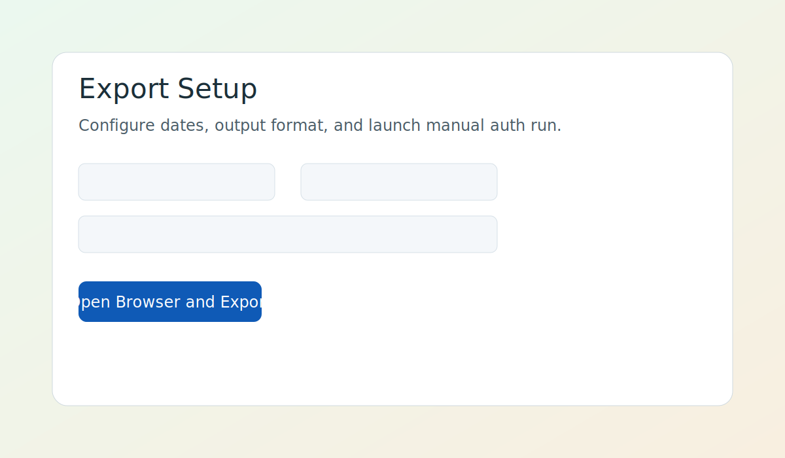
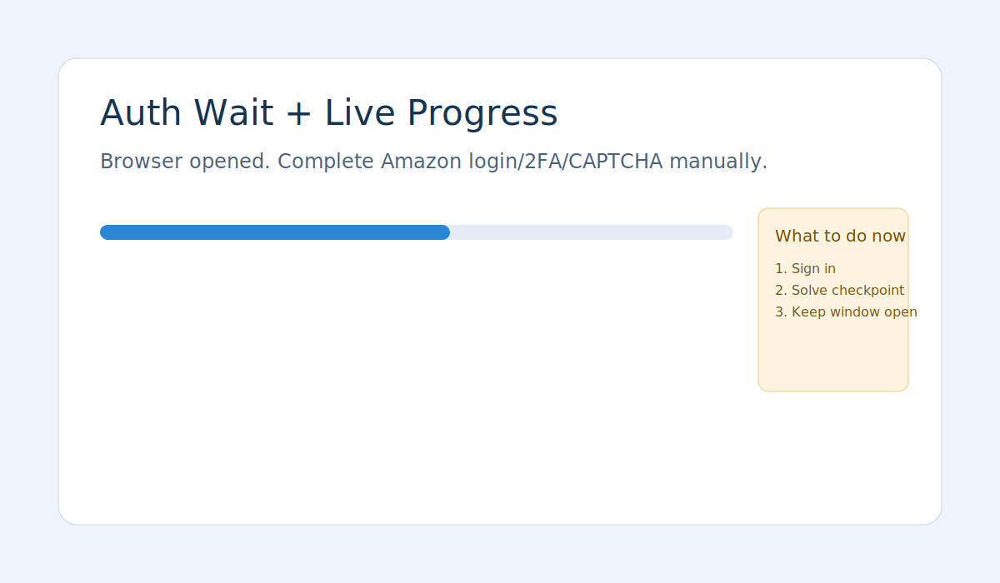
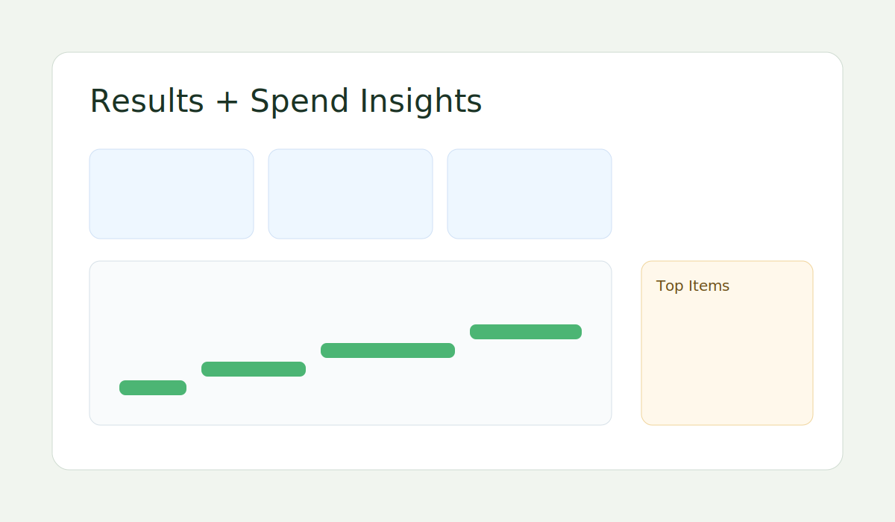

# Amazon Spend Exporter

Amazon Spend Exporter helps you download your Amazon order history and understand your spending without manual copy/paste.

It runs fully on your computer. You sign in to Amazon yourself in a real browser window.

## Who this is for
- People who want a clean year-end spending report
- Small business owners reviewing purchases made from personal Amazon accounts
- Anyone who wants to audit Amazon spend over time

## What you get
- Export files: `CSV` and `XLSX`
- Simple dashboard with:
  - total spend
  - number of orders
  - number of items
  - average order value
  - median order value
  - max order value
  - most expensive item
  - monthly spend chart with month-by-month drilldown
  - shipping/tax/discount summary

## 5-minute setup
1. Install dependencies:

```bash
npm install
npx playwright install chromium
```

2. Start the app:

```bash
npm start
```

3. Open: `http://localhost:4173`

## How to use (non-technical)
1. Click **Start**.
2. Pick your date range.
3. Click **Start Export**.
4. Complete Amazon login/CAPTCHA in the opened browser window.
5. When complete, open **Results** and download your files.

## Privacy and security
- Runs locally on your machine
- Credentials are never stored by this app
- Login, 2FA, and CAPTCHA are done manually in Amazon UI
- No cloud sync and no telemetry

Read more: [docs/PRIVACY-SECURITY.md](./docs/PRIVACY-SECURITY.md)

## Troubleshooting
- [Quickstart](./docs/QUICKSTART.md)
- [Troubleshooting](./docs/TROUBLESHOOTING.md)
- [FAQ](./docs/FAQ.md)
- [Limitations](./docs/LIMITATIONS.md)

## Screenshots
- Export setup: 
- Auth wait + progress: 
- Results dashboard: 

## Advanced (developers)
CLI and local API are still available.

### CLI example
```bash
npm run build
node dist/cli.js export --from 2025-01-01 --to 2025-12-31 --out ./exports --format both --headless false
```

### Local API
- `POST /api/exports`
- `GET /api/exports/:runId`
- `GET /api/exports/:runId/events`
- `GET /api/exports/:runId/warnings`
- `GET /api/exports/:runId/insights`
- `GET /api/exports/:runId/files/:name`
- `GET /api/health`

## Project status
`v0.2.0` local MVP. Amazon page changes can affect extraction quality over time.

## License
MIT. See [LICENSE](./LICENSE).
